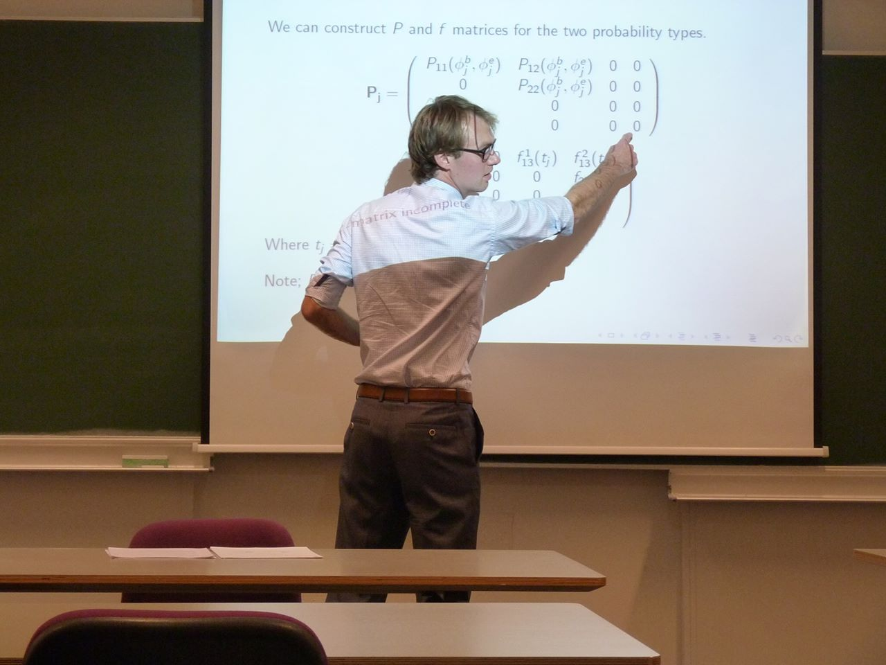
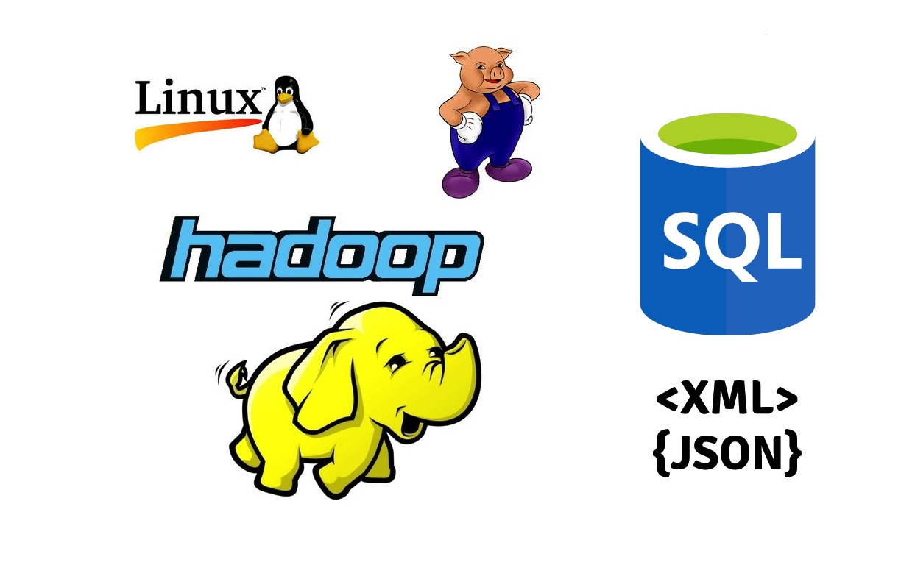

## Hi guys

## Data science, statistics how do they relate?
"The fact that data science exists as a field is a colossal failure of statistics" - **Hadley Wickham**

"I do think it would be fair to consider statistics (...) as a subset of data science" - **Andrew Gelman**

"A data scientist is a statistician who lives in San Francisco" - **quote on Twitter**

## What is data science?

## Skills vs Company type

## Rabobank Data Scientist

## What do we have covered?

## Basic Skills to work with data

## Software Engineering
Programming is just one skill needed for software engineering.

Statisticians mostly code for analysis, maybe implementing some new methods.

Software implementation usually done by others.

Statisticians can still learn a lot from software enginering, like unit testing and profiling.

## Statistics

## Machine Learning

## Data Munging

## Data Munging
Not only cleaning dirty data, also deal with numerous file types and data base types.

## Visualization and Communication

## Visualization and Communication

## Thinking Like a Data Scientist
Applying the scientific method to business problems.

Create business value, even when there's not a big challenge for you.

Recognize opportunities, push solutions.

Want to make a difference, cause action.