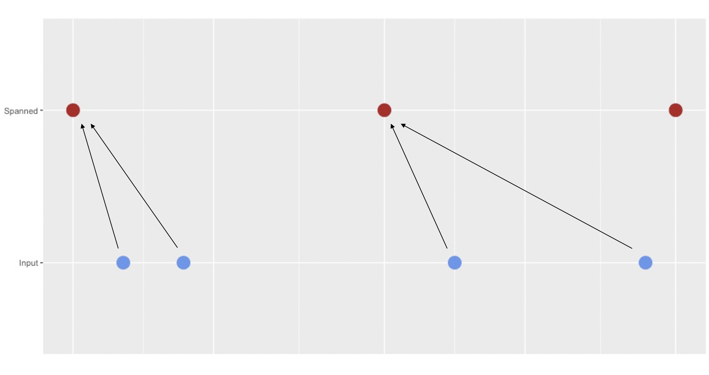
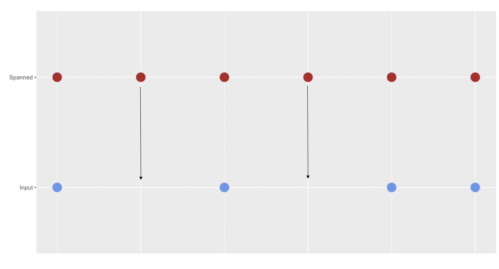

## Automatically generated data

```{r, out.width="700px", echo=FALSE}

```

## With this data we might like to:

* Look for trends over time

```{r, echo=FALSE, message=FALSE, cache=TRUE}
library(padr); library(dplyr); library(ggplot2)
emergency %>% filter(title == 'EMS: DEHYDRATION') %>% 
  thicken(interval = 'day') %>% count(time_stamp_day) %>% pad %>% 
  fill_by_value(n) %>% 
  ggplot(aes(time_stamp_day, n)) +
  geom_point() +
  geom_smooth() +
  xlab("") +
  ylab("")
```

## With this data we might like to:

* Compare different moments in time

```{r, echo=FALSE, message=FALSE, cache=TRUE}
library(padr); library(dplyr); library(ggplot2)
emergency %>% filter(title == 'Traffic: VEHICLE ACCIDENT -') %>% 
  thicken(interval = 'hour') %>% count(time_stamp_hour) %>% pad %>% 
  fill_by_value(n) %>% 
  mutate(hour_of_day = lubridate::hour(time_stamp_hour)) %>% 
  ggplot(aes(hour_of_day %>% factor, n)) +
  geom_boxplot(fill = 'cornflowerblue') +
  xlab("Hour of the day") +
  ylab("")
```

## With this data we might like to:

Do other time series analysis

* Look for seasonality
* Fit ARIMA models
* Calculate a moving average
* Do forecasting

But also other types of analysis involve processing timestamp data.

## However our data looks like this

```{r, message=FALSE}
library(padr)
library(dplyr)
padr::emergency %>% head
```


## *padr* helps out with two challenges

Every row is a single observation, typically on second level. You want to do analysis on a (much) higher level.

* `padr` offers: `thicken` used in conjunction with a database package, like `dplyr`.

```{r}
emergency %>% thicken(interval = "month") %>% 
  count(time_stamp_month) %>% head
```

## *padr* helps out with two challenges

When there is no observation, there is no record.

* `padr` offers: `pad`

```{r}
data.frame(dt  = as.Date(c("2017-02-23", "2017-02-26")), 
           val = c(2, 4)) %>% 
  pad
```


## The *interval*

Think of timedata as having a hearbeat. It produces data at a certain *interval*.

`padr` currently uses eight intervals: year, quarter, month, week, day, hour, minute, and second.

```{r}
get_interval(emergency$time_stamp)
```

The *interval* is the highest of the eight that can explain all the instances observed in the data.

```{r}
dt <- as.Date(c("2017-02-23", "2017-02-26"))
all(dt %in% seq(dt %>% min, dt %>% max, by = 'day'))
```

## **thicken**

The `thicken` function takes in a data frame, then it does:

* look for the datetime variable in the data frame.
* assess the interval of this variable.
* span a variable of a *higher* interval around it.
* assign each original observation to a value in the spanned variable.
* add the the assignments to the original data frame.

## **thicken**

```{r, out.width="700px", echo=FALSE}

```


## **thicken**

`thicken` parameters:

```{r, eval = FALSE}
x

interval = c("level_up", "year", "quarter", "month", 
    "week", "day", "hour", "min")

colname = NULL

rounding = c("down", "up")

by = NULL

start_val = NULL
```


## **pad**

The `pad` function takes in a data frame, then it does:

* look for the datetime variable in the data frame.
* assess the interval of this variable.
* span a variable of the **same** interval around it.
* merge the original variable with the spanned variable.
* leave `NA` values for the other variables.

## **pad**

```{r, out.width="700px", echo=FALSE}

```

## **pad**
```{r, eval = FALSE}
x

interval = NULL

start_val = NULL

end_val = NULL

by = NULL

group = NULL
```


## **pad**

Last week v0.2.0 came out (and patch release v0.2.1 :) ), that introduced group padding.

```{r}
emergency %>% 
  thicken('month', col = "m") %>% 
  count(m, title) %>% 
  pad(group = "title", 
      start_val = as.Date("2015-12-01"),
      end_val   = as.Date("2016-10-01"))
```


## Fill the missings

After padding you are left with the missing values for the imputed records.

```{r}
padded_df <- 
  data.frame(dt  = as.Date(c("2017-02-23", "2017-02-25", "2017-02-27")), 
           val = c(2, 4, 2)) %>% pad

padded_df
```

## Fill the missings

Depending on the nature of the data you might want to:

*Carry the last value forward*

```{r}
padded_df %>% 
  tidyr::fill(val)
```

## Fill the missings

Depending on the nature of the data you might want to:

*Fill all the missings with the same value*

```{r}
padded_df %>% 
  fill_by_value(val, value = 42)
```

## Fill the missings

Depending on the nature of the data you might want to:

*Fill all the missings with a function of the nonmissings*

```{r}
padded_df %>% 
  fill_by_function(val, fun = mean)
```

## Fill the missings

Depending on the nature of the data you might want to:

*Fill all the missings with the most prevalent of the nonmissings*

```{r}
padded_df %>% 
  fill_by_prevalent(val)
```

## Final example to wrap up

```{r}
library(ggplot2)
animal_bites_plot <- 
  emergency %>% 
  filter(title == 'EMS: ANIMAL BITE') %>% 
  thicken(interval = 'day', col = 'ts_day') %>% 
  count(ts_day) %>% 
  pad %>% 
  fill_by_value(n) %>% 
  ggplot(aes(ts_day, n)) +
  geom_point() +
  geom_line() +
  geom_smooth()
```

## Final example to wrap up

```{r, message=FALSE}
animal_bites_plot
```

## Future plans

Spanning instead of date altering is very powerful, full potential is not used now.

Enable the user to apply a custom span, `seq` is very flexible.

```{r}
seq(as.Date('2017-02-23'), as.Date('2017-03-03'), by = "3 days")
```

Still need to figure out how to fit it in neatly with the *interval* paradigm.

## More information

There are two vignettes, a general introduction and more details on the implementation.

```{r, eval=FALSE}
vignette("padr")
vignette("padr_implementation")seq(as.Date('2017-02-23', by = "3 days", length.out = 4))
```


I blog about changes in `padr` on:
thats-so-random.com


And the package is maintained on:
github.com/EdwinTh/padr
